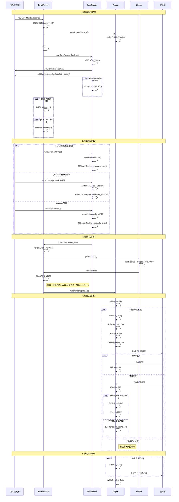

# 前端监控系统时序图

## 系统架构概述

这是一个前端错误收集监控系统，主要包含以下组件：

- **ErrorMonitor**: 主监控类，负责初始化和协调各个模块
- **ErrorTracker**: 错误追踪器，负责捕获各种类型的错误
- **Report**: 错误上报器，负责将错误数据发送到服务器
- **Helper**: 辅助工具，负责获取设备信息

## 时序图

## 关键流程说明

### 1. 初始化流程

- 用户创建ErrorMonitor实例并传入配置
- 系统初始化Report实例用于错误上报
- 创建ErrorTracker实例并绑定错误处理回调
- ErrorTracker注册各种错误监听器
- 根据配置启用性能监控和XHR监控

### 2. 错误捕获机制

- **JavaScript错误**: 通过window.error事件捕获
- **Promise拒绝**: 通过unhandledrejection事件捕获
- **Console错误**: 通过重写console.error方法捕获

### 3. 错误数据增强

- 原始错误信息 + 应用ID + 设备信息 + 页面位置 + 用户代理
- 设备信息包括：设备类型、浏览器、操作系统、屏幕信息等

### 4. 可靠的错误上报

- 队列机制确保错误按顺序上报
- 重试机制处理网络失败情况
- 超时控制避免长时间等待
- 并发控制确保同时只有一个请求在发送

### 5. 容错设计

- 最大重试次数限制避免无限重试
- 队列机制确保错误不丢失
- 异步处理不阻塞主线程

## 技术特点

1. **全面的错误捕获**: 覆盖JavaScript错误、Promise拒绝、Console错误
2. **丰富的上下文信息**: 自动收集设备、浏览器、页面等环境信息
3. **可靠的数据传输**: 队列+重试机制确保数据可靠上报
4. **模块化设计**: 各组件职责清晰，易于维护和扩展
5. **配置灵活**: 支持自定义DSN、应用ID等配置项
